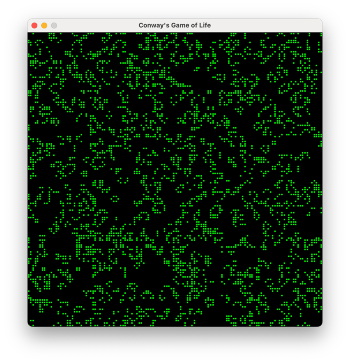

准备好学习 Mojo！本教程通过构建一个完整的程序来带你了解 Mojo，这个程序不仅仅是打印"Hello, world!"

我们将构建一个 [Conway 生命游戏](https://en.wikipedia.org/wiki/Conway%27s_Game_of_Life)的版本，这是一个自复制系统的模拟。如果你以前没听说过它，不用担心——当你看到它运行时就会明白了。让我们开始吧，这样你就可以学习 Mojo 编程基础，包括以下内容：

- 使用基本内置类型如 `Int` 和 `String`
- 使用 `List` 管理值序列
- 以结构体（数据结构）的形式创建自定义类型
- 创建和导入 Mojo 模块
- 导入和使用 Python 库

有很多内容要学习，但我们尽量保持解释简单。如果你只想看完成的代码，可以在 [GitHub 上获取](https://github.com/modular/modular/tree/main/mojo/examples/life)。

:::tip[开始之前]

你可以使用 Mac、Linux 或 Windows（WSL）。详情请参阅[系统要求](/docs/requirements/)。

如果你在跟随本教程时使用 AI 编程助手，请先安装 [Mojo 智能体技能](/docs/tools/skills)。模型可能会落后于当前语言。技能会定期更新最新的语法和语言特性。

```bash
npx skills add modular/skills
```

:::

## 1. 创建 Mojo 项目

要安装 Mojo，我们推荐使用 [`pixi`](https://pixi.sh/latest/)（其他选项请参阅[安装指南](/install/)）。

1. 如果你没有 `pixi`，可以使用以下命令安装：

    ```sh
    curl -fsSL https://pixi.sh/install.sh | sh
    ```

2. 导航到要创建项目的目录并执行：

    ```bash
    pixi init life \
      -c https://conda.modular.com/max/ -c conda-forge \
      && cd life
    ```

   这会创建一个名为 `life` 的项目目录，添加 Modular conda 包通道，并进入该目录。
   :::tip
   如果你[将这些通道添加为默认值](/pixi#create-a-project-and-virtual-environment)，可以跳过 `-c` 选项。
   :::

3. 安装 `mojo` 包：

    ```bash
    pixi add mojo
    ```

4. 现在让我们列出项目内容：

    ```bash
    ls -A
    ```

    ```output
    .gitattributes
    .gitignore
    .pixi
    pixi.lock
    pixi.toml
    ```

你应该看到项目目录包含：

- 初始的 `pixi.toml` 清单文件，定义项目依赖和其他特性

- 名为 `pixi.lock` 的[锁定文件](https://pixi.sh/latest/workspace/lockfile/)，指定传递依赖和项目虚拟环境中安装的实际包版本

- 包含项目 conda 虚拟环境的 `.pixi` 子目录

- 初始的 `.gitignore` 和 `.gitattributes` 文件，如果你计划在项目中使用 Git 版本控制，可以选择使用

:::note
永远不要直接编辑锁定文件。如果你编辑清单文件，`pixi` 命令会自动更新锁定文件。
:::

让我们通过检查项目虚拟环境中安装的 Mojo 版本来验证项目配置正确。`pixi run` 在项目的虚拟环境中执行命令，所以让我们用它来执行 `mojo --version`：

```bash
pixi run mojo --version
```

你应该看到一个版本字符串，指示安装的 Mojo 版本，默认情况下应该是最新版本。你可以在 `pixi.toml` 文件的依赖列表中查看和编辑项目的版本。

太好了！现在让我们编写第一个 Mojo 程序。

## 2. 创建"Hello, world"程序

在项目目录中，创建一个名为 `life.mojo` 的文件，包含以下代码行：

```mojo title="life.mojo"
# 我的第一个 Mojo 程序！
def main():
    print("Hello, World!")
```

{/*  markdownlint-disable MD013  */}
:::note
你可以使用任何你喜欢的编辑器或 IDE。如果你使用 [Visual Studio Code](https://code.visualstudio.com/)，你可以利用 [Mojo for Visual Studio Code 扩展](https://marketplace.visualstudio.com/items?itemName=modular-mojotools.vscode-mojo)，它提供语法高亮、代码补全和调试支持等功能。对于 [Cursor](https://cursor.com/) 和其他支持 VS Code 扩展的编辑器，你可以从 [Open VSX Registry](https://open-vsx.org/) 安装 [Mojo for Visual Studio Code 扩展](https://open-vsx.org/extension/modular-mojotools/vscode-mojo)。
:::
{/*  markdownlint-enable MD013  */}

如果你以前用 Python 编程过，这应该看起来很熟悉。

- 我们使用 `def` 关键字定义一个名为 `main` 的函数。
- 你可以使用任意数量的空格或制表符进行缩进，只要整个代码块使用相同的缩进即可。我们将遵循 [Python 风格指南](https://peps.python.org/pep-0008/)并使用 4 个空格。
- 这个 [`print()`](/docs/std/io/io/print/) 函数是 Mojo 内置的，所以不需要导入。

可执行的 Mojo 程序*要求*你定义一个无参数的 `main()` 函数作为入口点。运行程序会自动调用 `main()` 函数，当 `main()` 函数返回时程序退出。

要运行程序，我们首先需要在项目的虚拟环境中启动一个 shell 会话：

```bash
pixi shell
```

稍后，当你想退出虚拟环境时，只需输入 `exit`。

现在我们可以使用 `mojo` 命令运行程序。

```bash
mojo life.mojo
```

```output
Hello, World!
```

Mojo 是编译型语言，不是像 Python 那样的解释型语言。当我们像这样运行程序时，`mojo` 执行[即时编译](https://en.wikipedia.org/wiki/Just-in-time_compilation)（JIT）然后运行结果。

我们也可以使用 [`mojo build`](/docs/cli/build) 将程序编译成可执行文件：

```bash
mojo build life.mojo
```

默认情况下，这会将名为 `life` 的可执行文件保存到当前目录。

```bash
./life
```

```output
Hello, World!
```

## 3. 创建和使用变量

让我们通过提示用户输入姓名并将其包含在问候语中来扩展这个基本程序。内置的 [`input()`](/docs/std/io/io/input/) 函数接受一个可选的 [`String`](/docs/std/collections/string/string/String/) 参数作为提示，并返回一个由用户输入的字符组成的 `String`（末尾的换行符被去除）。

让我们声明一个变量，将 `input()` 的返回值赋给它，并构建一个自定义问候语。

```mojo title="life.mojo"
def main() raises:
    var name: String = input("你是谁？")
    var greeting: String = "你好，" + name + "！"
    print(greeting)
```

运行它：

```bash
mojo life.mojo
```

```output
你是谁？Edna
你好，Edna！
```

注意这段代码使用了 `String` 类型注解，指示变量可以包含的值的类型。Mojo 编译器执行[静态类型检查](https://en.wikipedia.org/wiki/Type_system#Static_type_checking)，这意味着如果你的代码试图将一种类型的值赋给不同类型的变量，你会遇到编译时错误。

Mojo 还支持隐式声明变量，你只需将值赋给新变量，而不使用 `var` 关键字或指示其类型。我们可以用以下代码替换刚才输入的代码，它的工作方式完全相同。

```mojo title="life.mojo"
def main() raises:
    name = input("你是谁？")
    greeting = "你好，" + name + "！"
    print(greeting)
```

但是，隐式声明的变量仍然有固定类型，Mojo 会从初始值赋值自动推断类型。在这个例子中，`name` 和 `greeting` 都被推断为 `String` 类型变量。如果你随后尝试将整数值如 42 赋给 `name` 变量，你会因为类型不匹配而得到编译时错误。你可以在 Mojo 手册的[变量](/docs/manual/variables/)部分了解更多关于 Mojo 变量的内容。

## 4. 使用 Mojo `Int` 和 `List` 类型表示游戏状态

正如 John Conway 最初设想的那样，游戏的"世界"是一个无限的二维方形单元网格，但对于我们的实现，我们将网格限制为有限大小。将网格边缘设为硬边界的一个缺点是边缘周围的相邻单元比内部少，这往往导致死亡。因此，我们将世界建模为一个环面（甜甜圈形状），其中顶行被视为与底行相邻，左列被视为与右列相邻。这将在稍后实现计算每个后续代的算法时发挥作用。

为了跟踪网格的高度和宽度，我们将使用 [`Int`](/docs/std/builtin/int/Int/)，它表示 CPU [字长](https://en.wikipedia.org/wiki/Word_(computer_architecture))的有符号整数，通常是 32 或 64 位。

为了表示单个单元的状态，我们将使用 `Int` 值 1（已填充）或 0（未填充）。稍后，当我们需要确定单元周围已填充邻居的数量时，我们可以简单地添加相邻单元的值。

为了表示整个网格的状态，我们需要一个[集合类型](/docs/manual/types#collection-types)。最适合这种情况的是 [`List`](/docs/std/collections/list/List/)，它是一个动态大小的值序列。

Mojo `List` 中的所有值必须是相同类型，以便 Mojo 编译器确保类型安全。（例如，当我们从 `List[Int]` 检索值时，编译器知道该值是 `Int` 并可以验证我们正确使用它。）Mojo 集合实现为[泛型类型](https://en.wikipedia.org/wiki/Generic_programming)，所以我们可以通过在方括号中指定[类型参数](/docs/manual/parameters/#parameterized-structs)来指示特定集合将保存的值类型：

```mojo
# row 中的 List 只能包含 Int 值
row = List[Int]()

# names 中的 List 只能包含 String 值
names = List[String]()
```

我们也可以使用一组初始值创建 `List` 并让编译器推断类型。使用*列表字面量*语法，只需将值括在方括号（`[]`）中：

```mojo
# 使用列表字面量语法创建 List[Int]，推断类型
nums2 = [12, -7, 64]

# 等同于
nums2: List[Int] = [12, -7, 64]
```

Mojo `List` 类型包括追加到列表、从列表弹出值以及使用下标符号访问列表项的能力。以下是这些操作的一些示例：

```mojo
nums = [12, -7, 64]
nums.append(-937)
print("列表中的元素数量:", len(nums))
print("从列表中弹出最后一个元素:", nums.pop())
print("列表的第一个元素:", nums[0])
print("列表的第二个元素:", nums[1])
print("列表的最后一个元素:", nums[len(nums) - 1])
```

```output
列表中的元素数量: 4
从列表中弹出最后一个元素: -937
列表的第一个元素: 12
列表的第二个元素: -7
列表的最后一个元素: 64
```

我们也可以嵌套 `List`：

```mojo
grid = [
    [11, 22],
    [33, 44]
]
print("第 0 行，第 0 列:", grid[0][0])
print("第 0 行，第 1 列:", grid[0][1])
print("第 1 行，第 0 列:", grid[1][0])
print("第 1 行，第 1 列:", grid[1][1])
```

```output
第 0 行，第 0 列: 11
第 0 行，第 1 列: 22
第 1 行，第 0 列: 33
第 1 行，第 1 列: 44
```

这看起来像是表示程序网格状态的好方法。让我们用以下代码更新 `main()` 函数，定义一个包含"[滑翔机](https://en.wikipedia.org/wiki/Glider_(Conway%27s_Game_of_Life))"模式初始状态的 8×8 网格。

注意我们从 `main()` 中删除了 `raises`。在之前的步骤中，`main()` 调用了可能抛出错误的 `input()`，所以它需要 `raises` 关键字。Mojo 函数默认是非抛出的——只有当函数可以将错误传播给其调用者时才需要 `raises`。由于 `main()` 不再调用任何抛出函数，我们可以省略它。有关错误处理的更多信息，请参阅[错误、错误处理和上下文管理器](/docs/manual/errors/)。

```mojo title="life.mojo"
def main():
    num_rows = 8
    num_cols = 8
    glider = [
        [0, 1, 0, 0, 0, 0, 0, 0],
        [0, 0, 1, 0, 0, 0, 0, 0],
        [1, 1, 1, 0, 0, 0, 0, 0],
        [0, 0, 0, 0, 0, 0, 0, 0],
        [0, 0, 0, 0, 0, 0, 0, 0],
        [0, 0, 0, 0, 0, 0, 0, 0],
        [0, 0, 0, 0, 0, 0, 0, 0],
        [0, 0, 0, 0, 0, 0, 0, 0],
    ]
```

### 在 Mojo 中复制值

在继续之前，让我们花点时间讨论 Mojo 如何处理复制值。在 Mojo 中，复制简单类型（如 `Int` 和 `String`）与复制更复杂类型（如 `List`）之间有一个重要区别：

- *显式可复制*类型可以通过调用其复制初始化器或 `copy()` 来复制。`List` 是显式可复制的，所以如果 `first` 是一个 `List`，你可以这样复制它：

  ```mojo
  first = [1, 2, 3]
  second = first.copy()  # 显式复制
  ```

  这使 `first` 保持不变，并为 `second` 分配其自己的、唯一拥有的列表副本。

- *隐式可复制*类型可以在不显式调用 `copy()` 或复制初始化器的情况下复制。`Int` 和 `String` 是隐式可复制类型，所以如果 `one_value` 是一个 `Int`，你可以这样复制它：

  ```mojo
  one_value = 15
  another_value = one_value  # 隐式复制
  ```

  这里，`one_value` 保持不变，`another_value` 获得值的副本。

隐式复制对于简单类型（如 `Int` 和 `String`）很有用，复制成本低且没有副作用。相反，`List` 可能占用数兆字节内存，意外复制可能会造成显著的性能损失。因此，`List` 类型仅支持显式复制以防止意外复制。理解这个区别在稍后定义和使用我们自己的自定义类型时将很重要。

:::tip

你可以通过检查类型的 API 文档来查看它符合哪些 *trait*，从而确定类型是显式还是隐式可复制的。Mojo [trait](/docs/manual/traits/) 是类型必须实现的一组要求，通常以一个或多个方法签名的形式。

- `List` 类型和其他 Mojo 集合类型如 [`Dict`](/docs/std/collections/dict/Dict/) 和 [`Set`](/docs/std/collections/set/Set/) 符合 [`Copyable`](/docs/std/builtin/value/Copyable/) trait，这表明它们是**显式可复制**的。

- `String`、`Int` 和其他数值类型符合 [`ImplicitlyCopyable`](/docs/std/builtin/value/ImplicitlyCopyable/) trait，这表明它们是**隐式可复制**的。此外，`ImplicitlyCopyable` trait 细化了 `Copyable` 和 `Movable` trait，所以你也可以像使用符合其他 trait 的类型一样使用符合 `ImplicitlyCopyable` trait 的类型。

:::

## 5. 创建和使用函数打印网格

现在让我们使用 `def` 关键字创建一个函数来生成游戏网格的字符串表示，以便我们可以将其打印到终端。要了解更多关于在 Mojo 中定义函数的信息，请参阅[函数](/docs/manual/functions/)。

让我们在程序中添加一个名为 `grid_str()` 的函数定义。Mojo 编译器不关心我们将函数添加在 `main()` 之前还是之后，但惯例是将 `main()` 放在最后。

```mojo title="life.mojo"
def grid_str(rows: Int, cols: Int, grid: List[List[Int]]) -> String:
    # 创建一个空 String
    str = String()

    # 遍历第 0 行到 rows-1 行
    for row in range(rows):
        # 遍历第 0 列到 cols-1 列
        for col in range(cols):
            if grid[row][col] == 1:
                str += "*"  # 如果单元已填充，追加星号
            else:
                str += " "  # 如果单元未填充，追加空格
        if row != rows-1:
            str += "\n"     # 在行之间添加换行符，但不在末尾
    return str
```

当我们向 Mojo 函数传递值时，默认行为是参数被视为值的*只读引用*。这对于像 `List` 这样的值特别有用，因为复制它们可能很昂贵。正如我们稍后将看到的，我们可以通过包含显式[参数约定](/docs/manual/values/ownership#argument-conventions)来指定不同的行为。

每个参数名后跟一个类型注解，指示可以传递给参数的值的类型。就像给变量赋值一样，如果你的代码试图将一种类型的值传递给不同类型的参数，你会遇到编译时错误。最后，参数列表后的 `-> String` 表示此函数有一个 `String` 类型返回值。

在函数体中，我们通过为每个已填充单元追加星号、为每个未填充单元追加空格来生成 `String`，用换行符分隔网格的每一行。我们使用嵌套的 `for` 循环遍历网格的每一行和每一列，使用 [`range()`](/docs/std/builtin/range/range/) 生成从 0 到（但不包括）给定结束值的整数序列。然后我们将正确的字符追加到 `String` 表示。有关 Mojo 中 `if`、`for` 和其他控制流结构的更多信息，请参阅[控制流](/docs/manual/control-flow)。

:::note

如 Mojo 手册的 [`for` 语句](/docs/manual/control-flow#the-for-statement)部分所述，可以直接迭代 `List` 的元素，而不是迭代 `range()` 的值然后通过数字索引访问 `List` 元素。

```mojo
nums = [12, -7, 64]
for value in nums:
    print("值:", value)
```

:::

现在我们已经定义了 `grid_str()` 函数，让我们从 `main()` 调用它。

```mojo title="life.mojo"
def main():
    ...
    result = grid_str(num_rows, num_cols, glider)
    print(result)
```

然后运行程序查看结果：

```bash
mojo life.mojo
```

```output
 *
  *
***


```

我们可以看到星号的位置与 `glider` 网格中 1 的位置相匹配。

## 6. 创建模块并定义自定义类型

我们目前向 `grid_str()` 传递三个参数来描述要打印的网格的大小和状态。更好的方法是定义我们自己的自定义类型，封装关于网格的所有信息。然后任何需要操作网格的函数都可以接受单个参数。我们可以通过定义 Mojo *结构体*来实现这一点，它是一个自定义数据结构。

[Mojo 结构体](/docs/manual/structs/)是一个自定义类型，由以下组成：

- *字段*，包含与结构关联的数据的变量
- *方法*，我们可以选择定义的函数，用于操作我们创建的结构体实例
- 可选地，结构体符合的一组 trait

:::note

Mojo 结构体类似于类。但是，Mojo 结构体*不*支持继承。Mojo 目前不支持类。

:::

我们可以在现有的 `life.mojo` 源文件中定义结构体，但让我们为结构体创建一个单独的*模块*。模块只是一个包含结构和函数定义的 Mojo 源文件，可以导入到其他 Mojo 源文件中。要了解更多关于创建和导入模块的信息，请参阅 Mojo 手册的[模块和包](/docs/manual/packages/)部分。

在项目目录中创建一个名为 `gridv1.mojo` 的新源文件，包含以下名为 `Grid` 的结构体定义，有三个字段：

```mojo title="gridv1.mojo"
@fieldwise_init
struct Grid(Copyable):
    var rows: Int
    var cols: Int
    var data: List[List[Int]]
```

Mojo 要求你在结构体定义中声明所有字段。你不能在运行时动态添加字段。你必须声明每个字段的类型，但不能在字段声明中赋值。

[构造函数](/docs/manual/lifecycle/life/#constructor)负责初始化所有字段的值，以及分配额外资源和执行结构体新实例所需的任何其他配置。你通过在结构体定义中定义一个名为 `__init__()` 的方法来实现构造函数。以下是我们*可以*如何为 `Grid` 实现构造函数的示例：

```mojo
    def __init__(out self, rows: Int, cols: Int, var data: List[List[Int]]):
        self.rows = rows
        self.cols = cols
        self.data = data^
```

构造函数的第一个参数是结构体新创建的实例，按惯例命名为 `self`。当你创建结构体的新实例时，Mojo 编译器会自动将实例传递给构造函数。注意在构造函数中，你必须为 `self` 参数包含 `out` [参数约定](/docs/manual/values/ownership#argument-conventions)。其余参数的值被分配给新实例的相应字段。（暂时不用担心 `var` 关键字和 `^` 字符。我们稍后会详细讨论它们。）

为了减少你需要编写的样板代码量，Mojo 提供了一个名为 [`@fieldwise_init`](/docs/reference/decorators/fieldwise-init/) 的装饰器，它会自动为你生成一个执行"字段级"初始化的构造函数。构造函数的参数与结构体的字段具有相同的名称和类型，并以相同的顺序出现。这意味着给定我们最初的 `Grid` 定义，我们可以像这样创建 `Grid` 的实例：

```mojo
my_grid = Grid(2, 2, [[0, 1], [1, 1]])
```

然后我们可以用"点"语法访问字段值：

```mojo
print("行数:", my_grid.rows)
```

```output
行数: 2
```

但是，我们还需要能够复制和移动 `Grid` 实例——例如，当我们把 `Grid` 实例传递给函数或方法时。Mojo 结构体支持几种不同的[生命周期方法](/docs/manual/lifecycle/)，定义结构体实例被创建、移动、复制和销毁时的行为。

符合 [`Movable`](/docs/std/builtin/value/Movable/) [trait](/docs/manual/traits/) 的结构体表示其值可以移动的类型，符合 [`Copyable`](/docs/std/builtin/value/Copyable/) trait 的结构体表示其值可以*显式*复制和/或移动的类型。然后你可以实现自定义的移动和复制构造函数，执行移动或复制实例所需的操作。

作为简单聚合其他类型且不需要自定义资源管理或生命周期行为的结构体的便利，你可以简单地指示结构体符合 `Movable` 或 `Copyable` trait，而无需实现相应的生命周期方法。在这种情况下，Mojo 编译器会自动为你生成缺失的方法。对于我们简单的 `Grid` 结构体，指示它符合 `Copyable` trait 就足以让 Mojo 编译器自动为我们生成缺失的方法。`Copyable` trait 还提供了复制初始化器和 `copy()` 的默认实现，所以你不需要自己实现。

:::note

如果你定义了一个简单结构体，其中所有字段都是符合 `ImplicitlyCopyable` trait 的类型——如 `String` 和数值类型——你可以指示你的结构体符合 `ImplicitlyCopyable` trait 而不是 `Copyable` trait。但是，我们的 `Grid` 结构体使用了 `List[List[Int]]` 字段，它不是隐式可复制的。

另请参阅 Mojo 手册的[值的生命周期](/docs/manual/lifecycle/life/)部分，了解不同生命周期方法以及如何实现它们的更多信息。

:::

## 7. 导入模块并使用自定义 `Grid` 类型

现在让我们编辑 `life.mojo` 从新模块导入 `Grid` 并更新代码使用它。

```mojo title="life.mojo"
from gridv1 import Grid

def grid_str(grid: Grid) -> String:
    # 创建一个空 String
    str = String()

    # 遍历第 0 行到 rows-1 行
    for row in range(grid.rows):
        # 遍历第 0 列到 cols-1 列
        for col in range(grid.cols):
            if grid.data[row][col] == 1:
                str += "*"  # 如果单元已填充，追加星号
            else:
                str += " "  # 如果单元未填充，追加空格
        if row != grid.rows - 1:
            str += "\n"     # 在行之间添加换行符，但不在末尾
    return str

def main():
    glider = [
        [0, 1, 0, 0, 0, 0, 0, 0],
        [0, 0, 1, 0, 0, 0, 0, 0],
        [1, 1, 1, 0, 0, 0, 0, 0],
        [0, 0, 0, 0, 0, 0, 0, 0],
        [0, 0, 0, 0, 0, 0, 0, 0],
        [0, 0, 0, 0, 0, 0, 0, 0],
        [0, 0, 0, 0, 0, 0, 0, 0],
        [0, 0, 0, 0, 0, 0, 0, 0],
    ]
    start = Grid(8, 8, glider^)
    result = grid_str(start)
    print(result)
```

所有这些更改都很直接，除了我们创建 `Grid` 实例的那一行。我们的新 `Grid` 需要*获取*表示网格状态的 `List[List[Int]]` 的所有权。（技术上讲，`Grid` 的 `data` 字段将拥有该值。）但是，`glider` 变量目前拥有该列表。

一种替代方案——如果我们计划稍后在 `main()` 中再次使用 `glider` 变量的值——是创建 `glider` 列表的副本传递给 `Grid` 构造函数，像这样：

```mojo
    start = Grid(8, 8, glider.copy())
```

在我们的情况下，我们不需要稍后再次使用 `glider` 变量，所以我们可以使用 `^` 转移符号将列表的*所有权转移*给 `Grid` 构造函数的相应参数。转移后，`glider` 变量未初始化。如果你想再次使用该变量，需要为其分配新值。有关所有权和 `^` 转移符号的更多信息，请参阅 Mojo 手册的[所有权](/docs/manual/values/ownership/)部分。

此时，我们做了几项改进程序结构的更改，但输出应该保持不变。

```bash
mojo life.mojo
```

```output
 *
  *
***


```

## 8. 将 `grid_str()` 实现为方法

我们的 `grid_str()` 函数实际上是 `Grid` 类型独有的实用函数。与其将其定义为独立函数，将其定义为 `Grid` 类型的一部分作为方法更有意义。

为此，将函数移动到 `gridv1.mojo` 并编辑成如下所示（或直接将以下代码复制到 `gridv1.mojo`）：

```mojo title="gridv1.mojo"
@fieldwise_init
struct Grid(Copyable):
    var rows: Int
    var cols: Int
    var data: List[List[Int]]

    def grid_str(self) -> String:
        # 创建一个空 String
        writer = String()

        # 遍历第 0 行到 rows-1 行
        for row in range(self.rows):
            # 遍历第 0 列到 cols-1 列
            for col in range(self.cols):
                if self.data[row][col] == 1:
                    # 如果单元已填充，写入星号
                    writer.write_string("*")
                else:
                    # 如果单元未填充，追加空格
                    writer.write_string(" ")
            if row != self.rows - 1:
                # 在行之间添加换行符，但不在末尾
                writer.write_string("\n")
        return writer
```

除了将代码从一个源文件移动到另一个之外，我们还做了一些其他更改：

- 函数定义被缩进以表示它是 `Grid` 结构体定义的方法。这也改变了我们调用函数的方式。
  不再是 `grid_str(my_grid)`，我们现在写 `my_grid.grid_str()`。
- 我们将参数名改为 `self`。当你调用实例方法时，Mojo 自动将实例作为第一个参数传递，后跟你提供的任何显式参数。虽然我们可以为此参数使用任何我们喜欢的名称，但惯例是称之为 `self`。
- 我们删除了参数的类型注解。编译器知道方法的第一个参数是结构体的实例，所以它不需要显式类型注解。
- 我们不需要为 `self` 参数添加显式[参数约定](/docs/manual/values/ownership#argument-conventions)，因为我们将其用作实例的只读引用，这是方法参数的默认行为。

现在我们已经将函数重构为实例方法，我们还需要更新 `life.mojo` 中从 `main()` 调用它的代码：

```mojo title="life.mojo"
from gridv1 import Grid

def main():
    glider = [
        [0, 1, 0, 0, 0, 0, 0, 0],
        [0, 0, 1, 0, 0, 0, 0, 0],
        [1, 1, 1, 0, 0, 0, 0, 0],
        [0, 0, 0, 0, 0, 0, 0, 0],
        [0, 0, 0, 0, 0, 0, 0, 0],
        [0, 0, 0, 0, 0, 0, 0, 0],
        [0, 0, 0, 0, 0, 0, 0, 0],
        [0, 0, 0, 0, 0, 0, 0, 0],
    ]
    start = Grid(8, 8, glider^)
    print(start.grid_str())
```

再次，我们的重构改进了代码结构，但它仍然产生相同的输出。你可以通过再次运行程序来验证这一点。

## 9. 实现对 `Writable` trait 的支持

你可以使用 `String(my_val)` 将大多数 Mojo 类型转换为 `String`，以生成该实例的 `String` 表示。但是，如果你尝试对我们当前的 `Grid` 实现这样做，你会得到错误。让我们修复它。

因为 Mojo 编译器执行静态类型检查，`String` 构造函数只有在值的类型实现了某些所需行为时才能接受该值——在这种情况下，它只接受可以生成 `String` 表示的类型。

为了强制执行这一点，`String()` 构造函数要求类型符合 [`Writable`](/docs/std/format/Writable/) trait。（这种类型的函数有时被称为[*泛型*函数](/docs/manual/parameters/#parameters-and-generics)。）每个 trait 都要求符合的类型实现一个 `write_to()` 方法，写入其 `String` 表示。（要了解更多信息，请阅读 [`Writable` trait](/docs/manual/traits/#the-writable-trait)。）

注意 `write_to()` 接受一个 `mut writer: Some[Writer]` 参数。`Writer` trait 表示任何可以写入的东西——`String` 缓冲区、文件、网络流等。通过写入泛型 `Writer` 而不是构建并返回 `String`，你的类型可以与任何输出目标一起工作。

我们的 `grid_str()` 方法已经写入了我们的 `String` 表示，所以看起来我们需要将其重命名为 `write_to()` 并向函数添加 `Writer` 参数，并删除 `String` 返回值。我们还需要指示 `Grid` 符合哪个 trait。在我们的情况下，它必须是 `Writable`。

在 `gridv1.mojo` 中，我们需要更新 `Grid` 声明以指示类型符合 `Writable`，并将 `grid_str()` 更新为 `write_to()`。

```mojo title="gridv1.mojo"
@fieldwise_init
struct Grid(Copyable, Writable):
    ...

    def write_to(self, mut writer: Some[Writer]):
      # 遍历第 0 行到 rows-1 行
      for row in range(self.rows):
          # 遍历第 0 列到 cols-1 列
          for col in range(self.cols):
              if self.data[row][col] == 1:
                  # 如果单元已填充，写入星号
                  writer.write_string("*")
              else:
                  # 如果单元未填充，写入空格
                  writer.write_string(" ")
          if row != self.rows - 1:
              # 在行之间添加换行符，但不在末尾
              writer.write_string("\n")
```

现在让我们验证 `String()` 可以与 `Grid` 实例一起使用。

```mojo title="life.mojo"
def main():
    ...
    start = Grid(8, 8, glider^)
    print(String(start))
```

如果你再次运行程序，你应该仍然看到与之前相同的滑翔机模式。

```bash
mojo life.mojo
```

```output
 *
  *
***


```

## 10. 实现支持索引的方法

查看 `write_to()` 的实现，你会注意到我们使用 `self.data[row][col]` 来检索网格中单元的值。如果 `my_grid` 是 `Grid` 的实例，我们会使用 `my_grid.data[row][col]` 来引用网格中的单元。这打破了封装的基本原则，因为我们需要知道 `Grid` 在名为 `data` 的字段中存储游戏状态，并且该字段是 `List[List[Int]]`。如果我们稍后决定更改 `Grid` 的内部实现，可能会有很多代码需要更改。

更干净的方法是提供"getter"和"setter"方法来访问单元值。我们可以简单地定义像 `get_cell()` 和 `set_cell()` 这样的方法，但这是展示我们如何为自定义 Mojo 类型定义内置运算符行为的好机会。具体来说，我们将实现对索引的支持，这样我们可以用像 `my_grid[row, col]` 这样的语法来引用单元。这在实现支持网格状态演化时将很有用。

如[运算符、表达式和 dunder 方法](/docs/manual/operators)所述，Mojo 允许我们通过实现特殊的 *dunder*（双下划线）方法来为自定义类型定义许多内置运算符的行为。对于索引，这两个方法是 `__getitem__()` 和 `__setitem__()`。让我们在 `gridv1.mojo` 的 `Grid` 结构体中添加以下方法：

```mojo title="gridv1.mojo"
@fieldwise_init
struct Grid(Copyable, Writable):
    ...
    def __getitem__(self, row: Int, col: Int) -> Int:
        return self.data[row][col]

    def __setitem__(mut self, row: Int, col: Int, value: Int) -> None:
        self.data[row][col] = value
```

`__getitem__()` 的实现很简单。对于给定的 `row` 和 `col` 值，我们只需要从实例的 `data` 字段中存储的嵌套 `List[List[Int]]` 中检索并返回相应的值。

`__setitem__()` 的主体同样简单。我们只需获取给定的 `value` 并将其存储在 `data` 中相应的 `row` 和 `col` 中。声明中的一个新内容是我们将返回类型设置为 `None` 以指示方法没有返回值。更值得注意的是我们为 `self` 参数添加了 `mut` [参数约定](/docs/manual/values/ownership/#argument-conventions)，以明确告诉 Mojo 编译器我们要修改当前实例的状态。如果我们省略 `mut`，我们会得到错误，因为编译器会默认为参数的只读访问。

现在我们已经实现了这些方法，我们可以更新 `write_to()` 以使用索引语法访问单元值。

```mojo title="gridv1.mojo"
@fieldwise_init
struct Grid(Copyable, Writable):
    ...
    def write_to(self, mut writer: Some[Writer]):
        ...
            # 遍历第 0 列到 cols-1 列
            for col in range(self.cols):
                if self[row, col] == 1:
                    ...
```

{/*  markdownlint-disable MD033  */}
<details>
  <summary>点击此处查看到目前为止完整的 `gridv1.mojo`：</summary>
{/*  markdownlint-enable MD033  */}

```mojo title="gridv1.mojo"
@fieldwise_init
struct Grid(Copyable, Writable):
    var rows: Int
    var cols: Int
    var data: List[List[Int]]

    def write_to(self, mut writer: Some[Writer]):
        # 遍历第 0 行到 rows-1 行
        for row in range(self.rows):
            # 遍历第 0 列到 cols-1 列
            for col in range(self.cols):
                if self[row, col] == 1:
                    # 如果单元已填充，写入星号
                    writer.write_string("*")
                else:
                    # 如果单元未填充，写入空格
                    writer.write_string(" ")
            if row != self.rows - 1:
                # 在行之间写入换行符，但不在末尾
                writer.write_string("\n")

    def __getitem__(self, row: Int, col: Int) -> Int:
        return self.data[row][col]

    def __setitem__(mut self, row: Int, col: Int, value: Int) -> None:
        self.data[row][col] = value
```

{/*  markdownlint-disable MD033  */}
</details>
{/*  markdownlint-enable MD033  */}

我们的重构没有改变程序的行为，但运行它以确保代码中没有任何错误仍然是个好主意。

## 11. 定义静态方法生成随机网格

到目前为止，我们使用滑翔机构建了 `Grid` 类型的基本功能。但是，更有趣的是从随机状态的网格开始，看看它如何随时间演化。

让我们向 `Grid` 结构体添加一个名为 `random()` 的*静态方法*来生成并返回一个具有随机状态的 `Grid` 实例。静态方法不对类型的特定实例进行操作，所以它可以作为实用函数调用。我们使用 `@staticmethod` 装饰器指示方法是静态的。

```mojo title="gridv1.mojo"
from std import random

@fieldwise_init
struct Grid(Copyable, Writable):
    ...
    @staticmethod
    def random(rows: Int, cols: Int) -> Self:
        # 使用当前时间为随机数生成器设置种子。
        random.seed()

        var data: List[List[Int]] = []

        for _ in range(rows):
            var row_data: List[Int] = []
            for _ in range(cols):
                # 生成随机 0 或 1 并追加到行。
                row_data.append(Int(random.random_si64(0, 1)))
            data.append(row_data^)

        return Self(rows, cols, data^)
```

在文件顶部，我们从 Mojo 标准库导入 `random` 包。它包含几个与随机数生成相关的函数。

默认情况下，Mojo 标准库使用的[伪随机数生成器](https://en.wikipedia.org/wiki/Pseudorandom_number_generator)目前使用固定种子。这意味着除非你提供不同的种子，否则它会生成相同的数字序列，这对于测试目的很有用。但是，对于此应用程序，我们要调用 `random.seed()` 以基于当前时间设置种子值，这每次都给我们一个唯一值。

然后我们创建 `data` 作为空 `List[List[Int]]`，我们将用随机初始状态填充它。对于每个单元，我们调用 [`random.random_si64()`](/docs/std/random/random/random_si64/)，它返回提供的最小值和最大值 0 和 1 之间的随机整数值。此函数实际上返回 `Int64` 类型的值，它是有符号 64 位整数值。如[数值类型](/docs/manual/types#numeric-types)所述，这与 `Int` 类型不同，`Int` 的精度取决于系统的本机字长。因此，我们将此值传递给 [`Int()`](/docs/std/builtin/int/Int/#__init__) 构造函数，它将数值显式转换为 `Int`。

创建完整的随机值行后，我们将其追加到 `data`。`data` 中的 `List` *拥有*其所有元素，所以当我们调用 `append()` 时，我们需要决定是转移新行的所有权还是提供其副本。在这种情况下，我们不需要再次使用该行，所以我们使用 `^` 转移符号将行的所有权转移给 `data` 中的 `List`。（追加 `Int` 值时我们不需要使用 `^` 符号，因为它们是*隐式*可复制的。）

方法的返回类型是 `Self`，它是结构体类型的别名。如果结构体的实际名称很长或包含参数，这是一个方便的快捷方式。最后一行使用 `Self()` 调用结构体的构造函数并返回一个新创建的具有随机数据的实例。再次，我们使用 `^` 转移符号将新创建的 `List[List[Int]]` 的所有权转移给新实例，而不是制作其副本。

:::note

上面代码中的 `for` 循环将循环值赋给"`_`"，即[*丢弃模式*](/docs/manual/lifecycle/death#explicit-lifetime-extension)，以表示它有意不使用。否则，Mojo 编译器会报告循环变量未使用的警告。

:::

现在我们可以更新 `life.mojo` 中的 `main()` 函数来创建随机 `Grid` 并打印它。

```mojo title="life.mojo"
...

def main():
    start = Grid.random(8, 16)
    print(String(start))
```

运行程序几次以验证它每次生成不同的网格。

```bash
mojo life.mojo
```

```output
*** *      ****
*  ****   ******
* * *****
*  * ** **
 *    * ** ****
* **  * * * ***
 * * **  **  **
  * ***** **
```

## 12. 实现演化网格的方法

终于到了让我们的世界演化的时候了。我们将实现一个 `evolve()` 方法来计算下一代网格的状态。一种选择是对现有 `Grid` 实例进行就地修改。相反，我们将让 `evolve()` 返回下一代的新 `Grid` 实例。

```mojo title="gridv1.mojo"
...
struct Grid(Copyable, Writable):
    ...
    def evolve(self) -> Self:
        next_generation = List[List[Int]]()

        for row in range(self.rows):
            row_data = List[Int]()

            # 计算相邻行索引，处理"环绕"
            row_above = (row - 1) % self.rows
            row_below = (row + 1) % self.rows

            for col in range(self.cols):
                # 计算相邻列索引，处理"环绕"
                col_left = (col - 1) % self.cols
                col_right = (col + 1) % self.cols

                # 确定当前单元周围的已填充单元数量
                num_neighbors = (
                    self[row_above, col_left]
                    + self[row_above, col]
                    + self[row_above, col_right]
                    + self[row, col_left]
                    + self[row, col_right]
                    + self[row_below, col_left]
                    + self[row_below, col]
                    + self[row_below, col_right]
                )

                # 确定下一代当前单元的状态
                new_state = 0
                if self[row, col] == 1 and (
                    num_neighbors == 2 or num_neighbors == 3
                ):
                    new_state = 1
                elif self[row, col] == 0 and num_neighbors == 3:
                    new_state = 1
                row_data.append(new_state)

            next_generation.append(row_data^)

        return Self(self.rows, self.cols, next_generation^)
```

我们从一个空的 `List[List[Int]]` 开始表示下一代的状态。然后我们使用嵌套 `for` 循环遍历现有 `Grid` 的每一行和每一列，以确定下一代每个单元的状态。

对于网格中的每个单元，我们需要计算已填充相邻单元的数量。因为我们将世界建模为环面，我们需要将顶行和底行视为相邻，将最左列和最右列视为相邻。当我们遍历每一行和每一列时，我们使用模运算符（`%`）来处理计算当前单元上下左右的行列索引时的"环绕"。（例如，如果有 8 行，则 `-1 % 8` 是 7。）

然后我们应用生命游戏规则，确定当前单元在下一代是已填充（1）还是未填充（0）：

- 有 2 或 3 个已填充邻居的已填充单元在下一代保持已填充
- 恰好有 3 个已填充邻居的未填充单元在下一代变为已填充
- 所有其他单元在下一代变为未填充

计算完下一代状态后，我们使用 `Self()` 创建一个新的 `Grid` 实例，并返回新创建的实例。

现在我们可以演化网格了，让我们在 `life.mojo` 中使用它。我们将添加一个 `run_display()` 函数来控制游戏的主循环：

- 显示当前 `Grid`
- 提示用户继续或退出
- 如果用户输入 `q` 则跳出循环
- 否则，计算下一代并再次循环

注意 `run_display()` 声明了 `raises`，因为它调用了可能抛出错误的 `input()`。由于 `main()` 调用 `run_display()` 而不处理错误，它也需要 `raises`。

还要注意 `run_display()` 使用 `var` 参数约定声明 `grid` 参数以获取 `Grid` 实例的所有权。如果我们使用默认的 `read` 参数约定，`grid` 将是绑定到原始 `Grid` 实例的不可变引用。在这种情况下，当我们尝试将 `grid.evolve()` 的结果赋给 `grid` 时，我们会得到编译时错误，因为 Mojo 不允许你将引用重新绑定到不同的值。有关更多信息，请参阅[引用绑定](/docs/manual/variables/#reference-bindings)。

然后我们将更新 `main()` 以创建随机初始 `Grid` 并将其传递给 `run_display()`，使用 `^` 符号转移所有权。以下是 `life.mojo` 的更新版本：

```mojo title="life.mojo"
from gridv1 import Grid

def run_display(var grid: Grid) raises -> None:
    while True:
        print(String(grid))
        print()
        if input("输入 'q' 退出或按 <Enter> 继续: ") == "q":
            break
        grid = grid.evolve()

def main() raises:
    start = Grid.random(16, 16)
    run_display(start^)
```

运行程序并验证每次调用 `evolve()` 都成功产生新一代。

现在我们有一个可工作的生命游戏版本，但终端界面不是很吸引人。让我们用 Python 库来制作更好的图形用户界面。

## 13. 导入和使用 Python 包

Mojo 允许你导入 Python 模块、调用 Python 函数以及从 Mojo 代码与 Python 对象交互。为了演示此功能，我们将使用一个名为 [pygame-ce](https://pyga.me/docs/index.html) 的 Python 包来为我们的生命游戏程序创建和管理图形用户界面。

首先，我们需要更新 `pixi.toml` 文件以添加对 Python 和 `pygame-ce` 包的依赖。在项目目录中，从终端执行以下命令：

```bash
pixi add "python>=3.11,<3.15"
pixi add --pypi "pygame-ce>=2.5.6,<3"
```

:::note

当你使用 Python 代码和包作为 Mojo 程序的一部分时，你创建了对兼容 Python 运行时和包的运行时依赖。使用 `mojo build` 构建程序的可执行版本*不会*将 Python 运行时或 Python 包合并到生成的可执行文件中。这些运行时 Python 依赖必须由运行可执行文件的环境提供。确保满足此要求的最简单方法是在虚拟环境（如由 [Pixi](https://pixi.sh/latest/) 或 [conda](https://docs.conda.io/) 管理的环境）中部署和运行 Mojo 可执行文件。

:::

你可以在 Mojo 中使用 [`Python.import_module()`](/docs/std/python/python/Python/#import_module) 导入 Python 模块。这以 `PythonObject` 包装器的形式返回对模块的引用。你必须将引用存储在变量中，以便随后可以访问模块中的函数和对象。例如：

```mojo
from std.python import Python

def run_display() raises:
    # 这大致等同于 Python 的 `import pygame`
    pygame = Python.import_module("pygame")

    # 初始化 pygame 模块
    pygame.init()
```

:::note

因为 Mojo 不支持全局作用域变量，你必须将 Python 模块导入到每个需要使用它的 Mojo 函数中，或者在函数之间将 `PythonObject` 包装的模块作为参数传递。

:::

你可以通过阅读 [Python 集成](/docs/manual/python/)了解更多关于在 Mojo 中导入和使用 Python 模块的信息。

一旦我们导入 `pygame`，我们就可以像编写 Python 代码一样调用其 API。对于此项目，我们将使用 `pygame` 创建新窗口并绘制整个游戏 UI。这需要完全重写 `run_display()` 函数。看看 `life.mojo` 的更新代码，我们将在下面解释更多：

```mojo title="life.mojo"
from std import time

from gridv1 import Grid
from std.python import Python


def run_display(
    var grid: Grid,
    window_height: Int = 600,
    window_width: Int = 600,
    background_color: String = "black",
    cell_color: String = "green",
    pause: Float64 = 0.1,
) raises -> None:
    # 导入 pygame Python 包
    pygame = Python.import_module("pygame")

    # 初始化 pygame 模块
    pygame.init()

    # 创建窗口并设置其标题
    window = pygame.display.set_mode(Python.tuple(window_width, window_height))
    pygame.display.set_caption("Conway 生命游戏")

    cell_height = Float64(window_height) / Float64(grid.rows)
    cell_width = Float64(window_width) / Float64(grid.cols)
    border_size = 1
    cell_fill_color = pygame.Color(cell_color)
    background_fill_color = pygame.Color(background_color)

    running = True
    while running:
        # 轮询事件
        for event in pygame.event.get():
            if event.type == pygame.QUIT:
                # 如果窗口关闭则退出
                running = False
            elif event.type == pygame.KEYDOWN:
                # 如果用户按 <Escape> 或 'q' 也退出
                if event.key == pygame.K_ESCAPE or event.key == pygame.K_q:
                    running = False

        # 通过用背景色绘制来清除窗口
        window.fill(background_fill_color)

        # 绘制网格中的每个活单元
        for row in range(grid.rows):
            for col in range(grid.cols):
                if grid[row, col]:
                    x = Float64(col) * cell_width + Float64(border_size)
                    y = Float64(row) * cell_height + Float64(border_size)
                    width = cell_width - Float64(border_size)
                    height = cell_height - Float64(border_size)
                    pygame.draw.rect(
                        window,
                        cell_fill_color,
                        Python.tuple(x, y, width, height),
                    )

        # 更新显示
        pygame.display.flip()

        # 暂停让用户欣赏场景
        time.sleep(pause)

        # 下一代
        grid = grid.evolve()

    # 干净地关闭 pygame
    pygame.quit()


def main() raises:
    start = Grid.random(128, 128)
    run_display(start^)
```

`run_display()` 的每个参数（除了 `grid`）都有与之关联的默认值（例如，默认 `window_height` 是 600 像素）。如果你在调用 `run_display()` 时没有显式传递参数值，Mojo 使用函数定义中指定的默认值。

导入 `pygame` 模块后，我们调用 `pygame.init()` 初始化所有 pygame 子系统。

`set_mode()` 函数创建并初始化一个窗口，宽度和高度作为两个值的 Python 元组传递。这返回窗口的 [`PythonObject`](/docs/std/python/python_object/PythonObject/) 包装器，我们可以用它调用函数和设置属性来操作窗口。（有关从 Mojo 与 Python 对象交互的更多信息，请参阅 [Python 类型](/docs/manual/python/types/)。）

`run_display()` 函数的大部分是一个循环，使用 `pygame` 轮询按键和鼠标点击等事件。如果它检测到用户按下 `q` 或 `<Escape>` 键或关闭显示窗口，它会用 `pygame.quit()` 结束程序。否则，它清除窗口并遍历网格中的所有单元以显示已填充的单元。在休眠 `pause` 秒后，它将网格演化到下一代并再次循环。

现在是时候尝试了。

```bash
mojo life.mojo
```

当你运行程序时，你应该看到屏幕上出现一个新窗口，显示你演化的网格。我们现在有了一个功能完整的生命游戏实现，带有漂亮的界面。我们已经从只在终端显示几个星号走了很长的路！



要退出程序，按 `q` 或 `<Escape>` 键，或关闭窗口。

现在我们已经完成了教程，退出项目的虚拟环境：

```bash
exit
```

## 总结

恭喜你从零开始编写了一个完整的 Mojo 应用程序！在这个过程中，你体验了：

- 使用 Pixi 创建、构建和运行 Mojo 程序
- 使用 Mojo 内置类型如 `Int`、`String` 和 `List`
- 操作显式和隐式可复制类型
- 管理值所有权和引用
- 创建和使用变量和函数
- 使用控制结构如 `if`、`while` 和 `for`
- 定义和使用自定义 Mojo 结构体
- 创建和导入 Mojo 模块
- 使用 Mojo 标准库中的模块
- 导入和使用 Python 模块

## 下一步

现在你已经看到了 Mojo 能做什么，以下是一些继续学习之旅的建议：

import ListingCard from '@site/src/components/Listing/ListingCard';
import ListingCards from '@site/src/components/Listing/ListingCards';

{/*  markdownlint-disable MD033  */}
<ListingCards>
  <ListingCard
    title="GPU 入门"
    url="/docs/manual/gpu/intro-tutorial"
    description="使用 Mojo 学习 GPU 编程基础"
  />

  <ListingCard
    title="GPU 谜题"
    url="https://puzzles.modular.com/introduction.html"
    description="通过解决日益复杂的挑战学习用 Mojo 编程 GPU"
  />

  <ListingCard
    title="代码示例"
    url="https://github.com/modular/modular/tree/main/mojo/examples"
    description="在 GitHub 上浏览各种 Mojo 代码示例"
  />
</ListingCards>
{/*  markdownlint-enable MD033  */}

:::tip

要在 Mojo 中使用 AI 编程助手，请参阅我们的[使用 Mojo AI 技能指南](/docs/tools/skills/)。

:::
